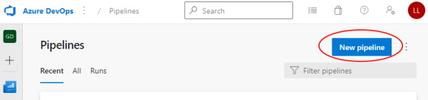
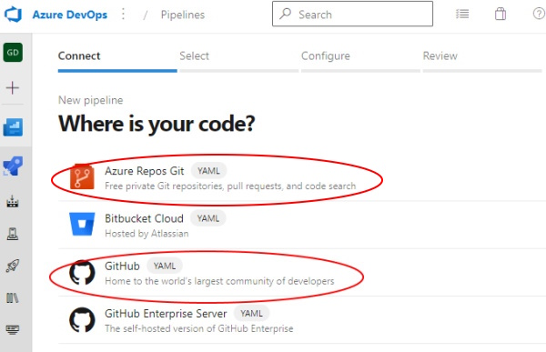
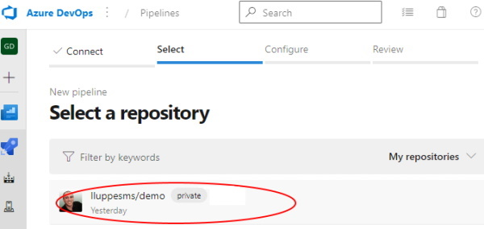
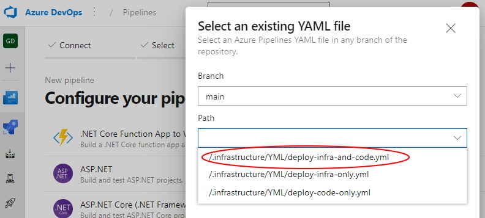
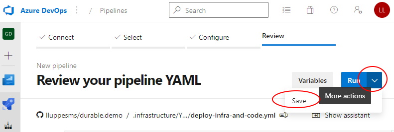
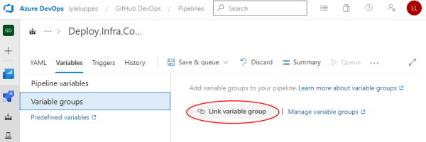
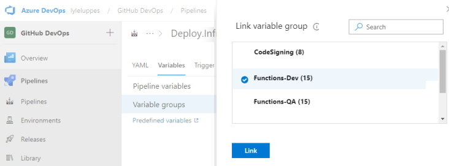

# Create Azure DevOps Pipelines

To create an Azure DevOps pipeline from an existing YML file in a GitHub repository, follow these steps.

---

**Step 1:** Click New pipeline from the Pipeline section of the Azure DevOps project

**Step 2:** Select source as GitHub:

**Step 3:** Select the GitHub repository

**Step 4:** Select Existing Pipelines YAML file

**Step 5:** Select the desired pipeline

**Step 6:** For most cases, when the pipeline source is shown, you can just click Run and start your pipeline.  However, if you need to adjust some settings, then select More Actions and Save the file.

**Step 7:** Once the file saved, the pipeline can be run or renamed and put into a folder.

<!-- **Step 7:** If you need to adjust some setting, once the new pipeline page is shown, click the Edit button.

**Step 8:** This may not seem intuitive, but the detailed editor is hidden behind the "Triggers" option of the pipeline editor, so select that.

**Step 9:** On the detailed pipeline editor, select Variables -> Variable Groups, and link the variable groups that are needed for this pipeline.

**Step 10:** More than one variable group can be added to a pipeline.

**Step 11:** Switch to the YAML tab and update the name of the pipeline to be what is desired. Now the "Save and queue" is ready, and the pipeline can be run.

 -->